# TRIAGE

**A decision layer for failed payments on Razorpay-style rails.** It reads a failure
reason, checks whether the rail is currently degraded, and returns a bounded, auditable
action — with a three-arm evaluation measuring whether that beats naive retries.

Built for the Razorpay Buildathon, Track 03 — AI Revenue Recovery.

---

## Introduction

A payment fails. Razorpay returns a reVason code — `insufficient_funds`,
`bank_technical_error`, `card_expired` — and tells the merchant what it means. It does
not tell them what to *do* about it. Most merchants answer with a fixed loop: wait 24
hours, retry, three times, give up.

That is wrong in two expensive directions at once. Re-attempting `card_expired` or
`invalid_vpa` can never succeed, and networks penalise repeated attempts on dead
credentials. Meanwhile a customer whose balance was empty on the 5th would have paid
happily on the 8th, and a schedule that gives up on day 3 loses someone who never
intended to leave. The underlying cause is that **"payment failed" is not a diagnosis** —
it is 110 different situations sharing one label.

So all 110 published reasons were classified by what a recovery system can actually do
about each one. **Only 27 of the 110 are recoverable without a human.** A "retry three
times" loop is therefore wrong on roughly three-quarters of failures: it wastes attempts
on 28 dead instruments, ignores 23 cases blocked on a person, hides 23 merchant
configuration bugs, and risks double-charging on 5 where the outcome is simply unknown.

**This project's contribution is not the taxonomy — Razorpay already publishes the error
reasons. It is the decision layer on top:** the mapping from 110 codes to eight bounded
action classes, the policy engine and bounded executor that enforce it, and the
evaluation that measures what it is worth.

| Action class | Codes | Meaning | Schedules a retry? |
|---|---|---|---|
| `SWITCH_INSTRUMENT` | 28 | Instrument unusable; a retry can never work | No |
| `NUDGE_CUSTOMER` | 23 | Blocked on a human action | No |
| `MERCHANT_ALERT` | 23 | Merchant misconfiguration, not a customer failure | No |
| `SWITCH_RAIL` | 15 | Rail degraded; same instrument, different route | Yes |
| `RETRY_SCHEDULED` | 9 | Will plausibly succeed later; predict when | Yes |
| `AWAIT_STATUS` | 5 | Outcome unknown; retrying risks a **double charge** | No |
| `STOP` | 4 | Retrying is unsafe or penalised | No |
| `RETRY_NOW` | 3 | Transient glitch, re-attempt in seconds | Yes |

Silently recoverable = `RETRY_NOW` + `RETRY_SCHEDULED` + `SWITCH_RAIL` = **27 of 110**.
Full per-code tables: [research/03](research/03-errors-cards-netbanking.md) (cards and
netbanking) and [research/04](research/04-errors-upi-wallets.md) (UPI and wallets).

---

## Research foundation — Stripe and Razorpay

### What Stripe already ships

Stripe does not solve involuntary churn with one tool. Their authorization stack is five
distinct mechanisms, each aimed at a different failure class:

| Mechanism | Failure class targeted | Technique |
|---|---|---|
| Smart Retries | Temporary decline (funds, timeout) | ML predicts the optimal re-attempt time, days ahead |
| Adaptive Acceptance | False decline — good payment wrongly rejected | Real-time retry with reformatted authorization request |
| Card Account Updater | Stale credentials | Fetches replacement card details from the issuer |
| Network Tokens | Credential rot, prevented | Token survives card reissue |
| `advice_code` | Unrecoverable | Explicitly signals `do_not_try_again` |

**The one architectural insight worth importing: latency is not a constraint.** Because
the best retry time is often days away, a scheduled-retry model can afford to be heavy —
Stripe's Smart Retries consumes 500+ attributes. Nothing about this problem forces a
low-latency model, which is why the design puts a real model in the loop without
apologising for it. The second borrowed idea: **a large part of the product is refusing to
act.** Stripe blocks low-probability payments specifically to avoid network penalties.
Knowing when to stop is a feature.

### What Razorpay's documentation supplied

Two things, both used as ground truth rather than paraphrased:

- **The published error taxonomy** — the 110 failure reasons, their explanations and their
  next-steps text. This is the actual data the project classifies, held in
  `error_policy.json` and never edited to make a result come out better.
- **The Downtime API schema** — modelled faithfully for rail health, so the simulated feed
  conforms to the published shape.

### What could not be replicated, and why

Stated plainly, because a reviewer will find it anyway:

| Stripe mechanism | Why it is out of reach here |
|---|---|
| **Adaptive Acceptance** | Reformats the authorization message itself — needs issuer-side access. TRIAGE models the *decision*, not the reformatting. |
| **Network Tokens** | Requires network certification. |
| **Card Account Updater** | Requires network membership; simulated only. |

### The part with no Stripe equivalent

Stripe optimises **one variable**: when to retry. Cards are effectively a single road.
Razorpay operates **four independent rails** — UPI, cards, netbanking, wallets — sharing
almost no infrastructure. So the optimisation is two-dimensional:

> **When do I retry, and which rail do I send it down?**

`SWITCH_RAIL` is that second dimension, and it has no analogue in Stripe's problem. It is
the India-specific contribution: for partner bank downtime, Razorpay's own documentation
recommends multi-terminal routing rather than waiting. Cards and netbanking (family A, 37
codes) are a *port* of a documented playbook; UPI and wallets (family B, 28 codes) are
*original* — no published decision mapping for NPCI failure reasons exists.

Full comparison, including the four structural India/Stripe differences:
[research/01-problem-and-solution.md](research/01-problem-and-solution.md).

---

## Tech stack

| Layer | Choice |
|---|---|
| API | FastAPI, Pydantic |
| Model | LightGBM |
| Store | SQLite (integer paise, never float) |
| Dashboard | Next.js 14 (App Router), React 18, Tailwind |
| Tooling | uv, pytest |
| Container | Docker |
| Hosting | Railway (API), Vercel (dashboard) |

---

## Architecture

```mermaid
flowchart TD
    A["payment.failed<br/>error_code + source"] --> B{"Policy engine<br/><b>error_policy.json</b><br/>deterministic, 110 codes"}

    B -->|"unknown code"| ERR["400 BAD_REQUEST_ERROR<br/><i>never defaults to retry</i>"]
    B --> C["Rail health lookup<br/>Downtime API feed"]

    C --> D{"Action class<br/>decided — I-1"}

    D -->|"RETRY_SCHEDULED · SWITCH_RAIL<br/>24 of 110 codes"| M["<b>LightGBM</b><br/>ranks candidate executions<br/>P(success &#124; context, action, time)"]
    D -->|"SWITCH_INSTRUMENT · NUDGE_CUSTOMER<br/>AWAIT_STATUS · STOP · MERCHANT_ALERT<br/>86 of 110 codes — model never consulted"| X["No retry scheduled<br/>scheduled_at = None"]

    M --> E["Bounded executor<br/>idempotency key {case_id}:{n}<br/>max_attempts · drop_dead_at"]
    X --> E

    E --> F[("Audit trail<br/>append-only, written<br/><i>before</i> the action")]

    style M stroke-dasharray: 5 5
    style B stroke-width:3px
    style F stroke-width:2px
```



The dashed box is the point: **86 of the 110 codes never reach the model at all.**

- **I-1 — the policy table decides the action class; the model never does.** LightGBM is
  consulted only for `RETRY_SCHEDULED` and `SWITCH_RAIL`, and only to rank candidate
  executions *within* a class the table has already permitted. A model error therefore
  cannot cause an unrecoverable failure to be retried. Safety is structural, not learned.
- **I-2 — an unknown code raises; it never falls back to a retry.** In the decision path
  that is `400`; the read-only taxonomy lookup returns `404`. Neither ever defaults.
- **I-9 — no event after `as_of` can influence a feature.** The feature builder takes
  `as_of` as a required argument with no default, so a rolling feature cannot silently
  aggregate the outcome it is meant to predict.
- **I-5 / I-6 — money safety is enforced below the policy.** Idempotency is a `UNIQUE`
  database index, not an `if` statement, and an `AWAIT_STATUS` case cannot reach an
  attempt without a resolved status poll.

Rendered diagram: [docs/architecture.png](docs/architecture.png). Component breakdown and
the nine-state machine: [research/02-architecture.md](research/02-architecture.md).

---

## LightGBM — what it does, and the result

The model estimates `P(success | failure context, candidate action, candidate time)`. It
does **not** choose the action: the class comes from the deterministic policy table, and
the model only ranks candidate executions within it. It is invoked for exactly two of the
eight action classes — `RETRY_SCHEDULED` and `SWITCH_RAIL` — covering 24 of 110 codes.

**Why LightGBM rather than a transformer:** the data is tabular with mixed
categorical/numeric columns, which is gradient boosting's home ground; the volume is tens
of thousands of simulated rows, orders of magnitude short of what a transformer needs; and
native feature importances are required by the audit trail. Stripe did move Adaptive
Acceptance to a TabTransformer — at billions of transactions. At this scale, GBDT is the
correct choice.

> ### The finding
>
> **The taxonomy is worth about twenty-one points. The model added nothing measurable.**
>
> Baseline beats control by **+21.2pp** (p < 0.001) under `normal`. Treatment beats
> baseline by **+0.2pp, p = 0.937** — and on the model-eligible surface alone, the only
> place it can move anything, it is **−4.5pp** (p = 0.516). Nothing was retuned to
> improve it.
>
> **The model is not the problem.** On a held-out temporal test split it reaches PR-AUC
> **0.965** against a **0.247** base rate (ROC-AUC 0.989, Brier 0.036), and its top
> features are the ones the research predicted:
>
> | feature | share of gain |
> |---|---|
> | `hours_since_first_failure` | 37.4% |
> | `days_to_salary_date` | 21.1% |
> | `day_of_month` | 13.4% |
> | **`candidate_delay_hours`** | **0.000%** — zero gain, zero splits |
>
> It found the Indian salary cycle from the calendar alone, without being told it exists.
> And then it could not use it. **`candidate_delay_hours` carries zero gain** because the
> training data comes from the baseline arm, which schedules `RETRY_SCHEDULED` at exactly
> `min_wait_hours` every single time. The dataset contains **no variation in the timing
> decision the model was built to make**. It can rank *which cases* will recover; it
> cannot rank *when* to retry, because nothing in its experience ever varied that.
>
> This is off-policy evaluation without exploration. No amount of training fixes it. The
> fix is an explorer arm that randomises delay within policy bounds — a change to the
> simulator, not the model. **An honest null with a diagnosis is a stronger result than a
> number engineered to be positive.**

Trained on a separate, larger population (seed 7, 40 000 payments, baseline arm only),
evaluated on seed 42 — 1784 rows, one per attempt (I-11), temporal split at days
1–21 / 22–26 / 27–30 (I-10), stopped at iteration 61. Full feature list (31 features) and
training config: [research/06-ml-lightgbm.md](research/06-ml-lightgbm.md).

---

## Evaluation design

Three arms, all consuming the **identical** generated population split by assignment, never
by regeneration (I-13):

| Arm | Behaviour | What its gap measures |
|---|---|---|
| `control` | Fixed retry +24h × 3. Reads neither the table nor rail health. | — the baseline to beat |
| `baseline` | Policy table only. No model. | `baseline − control` = the value of the **taxonomy** |
| `treatment` | Policy table for the class, model for the execution. | `treatment − baseline` = the value of the **model** |

Four measurement rules, each enforced by a test:

- **Dedup to the payment, not the attempt** (I-14) — one payment attempted four times is
  one payment, scored on final outcome. Counting attempts inflates recovery.
- **A trailing window is applied** (I-15) — a retry scheduled on day 28 may land on day 33;
  cutting at day 30 systematically undercounts.
- **Negative rows are always published** (I-16) — segments where the system loses ship
  alongside the wins.
- **Attempts and cost are reported beside recovery** (I-17) — recovering 3% more using
  twice the attempts has not necessarily won.

Two scenarios: `normal` and `bank_outage`. 8000 payments, 30 days plus a 7-day trailing
window, seed 42, hourly ticks.

### Results

| gap | what it isolates | `normal` | `bank_outage` |
|---|---|---|---|
| **baseline − control** | the **taxonomy** | **+21.2pp**, p = 0.000 | **+19.9pp**, p = 0.000 |
| **treatment − baseline** | the **model** | **+0.2pp**, p = 0.937 | **−0.2pp**, p = 0.949 |

Per-arm, scenario `normal` — recovery with Wilson 95% intervals, and cost beside it:

| arm | payments | recovered | rate | 95% CI | attempts | nudges |
|---|---|---|---|---|---|---|
| `control` | 445 | 60 | 13.5% | 10.6 – 17.0% | 1063 | 0 |
| `baseline` | 447 | 155 | **34.7%** | 30.4 – 39.2% | **144** | 150 |
| `treatment` | 461 | 161 | **34.9%** | 30.7 – 39.4% | 141 | 158 |

Baseline recovers roughly 2.6× as many payments as control **using about a seventh of the
attempts**.

### Where the system loses

Published, not tuned away. Under `normal`, the report flags **4 losing segments** (6 under
`bank_outage`), and they cluster on `SWITCH_RAIL`: `payment_failed` (treatment 80%, 4/5,
against 100% for both other arms) and `bank_not_available` (treatment 50%, 1/2, against
100%). At the action-class level treatment trails baseline by **−8.4pp** on `SWITCH_RAIL`
and **−3.4pp** on `NUDGE_CUSTOMER`; `request_timed_out` is the one code where baseline
itself trails control (50%, 2/4, against 100%, 3/3).

Every sample there is single digits, and the report says so — the `n` column is the first
thing to check before treating any row as a finding. The structural caveat behind
`SWITCH_RAIL` is real regardless of sample size: **every simulated outage window is shorter
than control's fixed 24-hour wait**, so "wait a day" accidentally does well on the class
the taxonomy exists to fix, and the real-world argument for switching — that the *customer*
will not wait a day — depends on abandonment, which **is not modelled here**.

Full per-code tables, every negative row included:
[eval/report-normal.md](eval/report-normal.md) ·
[eval/report-bank-outage.md](eval/report-bank-outage.md).

---

## Limitations

- **The data is synthetic.** No public NPCI decline dataset exists. Simulator parameters
  are grounded in Razorpay's published figures where those exist and marked as assumptions
  where they do not. The arm comparison is robust to the absolute level because all arms
  face the identical population — but the absolute recovery rates are not forecasts.
- **The simulator and the taxonomy make the same causal claim.** Both say a wrong PIN does
  not fix itself and an expired card cannot be charged. The evaluation therefore tests
  whether *acting* on that claim beats ignoring it — **not whether the claim is true.**
  This is the most important limitation in the project.
- **Per-code samples are small.** Roughly 150 cases per arm; per-code rows routinely carry
  n < 10, where one case moves the rate by more than ten points. Read the per-code table as
  directional and the headline interval as the real precision.
- **The negative-EV `STOP` is structurally unreachable at Indian ticket sizes.**
  `EV = P(success) × amount − ₹2`; against tickets of ₹99–₹25 000 the model would have to
  predict below ~0.04% for EV to go negative. The mechanism is built, tested and wired to
  the audit trail, and it fired **zero** times in both scenarios. Reported as zero rather
  than made to fire by inflating the attempt cost.
- **The model's high AUC flatters.** The simulator's causal structure is largely exposed by
  the observable features, so a well-specified model *should* score highly here. Read it as
  "the features describe this world", not as a production claim.
- **Adaptive Acceptance cannot be replicated** (needs issuer access), **Network Tokens are
  out of scope** (needs network certification), **Card Account Updater is simulated** (needs
  network membership), and **the Downtime API requires account enablement** — where
  unavailable, TRIAGE emits a simulated feed conforming to the published schema.
- **No auth.** research/05 specifies a Bearer key; it was out of scope. The deployed
  instance is read-only instead.

---

## Deployment

`Dockerfile` and `railway.toml` deploy the API to Railway with
`TRIAGE_READ_ONLY=true`: evaluation runs are baked into the image, and the instance
refuses every write — enforced both by a route dependency and by opening SQLite through
`mode=ro`. A public endpoint that can rewrite the numbers the submission reports is not
a demo. `POST /v1/recovery/decide` stays available because it is stateless.

The backend is live on Railway and redeploys automatically on a push to `main`; the
dashboard goes to Vercel with `dashboard/` as its root directory, reading the API's
location from `NEXT_PUBLIC_API_URL`. `DEPLOYMENT.md` has the full path and
`scripts/verify_live.sh` checks the deployed instance end to end.

---

## Running locally

```bash
# API — copy .env.example to .env first if you want to override defaults
uv sync --extra dev --extra ml
uv run python -m src.simulator.generate --n 8000 --days 30 --seed 42
uv run uvicorn src.api.main:app --reload         # http://127.0.0.1:8000/docs

# Dashboard — copy dashboard/.env.local.example to dashboard/.env.local
cd dashboard && npm install && npm run dev       # http://localhost:3000
```

Reproduce the evaluation from scratch (two runs at one seed produce byte-identical report
JSON *and* identical rendered markdown):

```bash
uv run python -m eval.run_arms --seed 42 --scenario normal      --arms control,baseline,treatment
uv run python -m eval.run_arms --seed 42 --scenario bank_outage --arms control,baseline,treatment
```

### Verification

Nothing here is asserted from memory — four entry points regenerate it:

```bash
uv run pytest -v                             # 544 tests
bash scripts/verify_api.sh                   # 87 assertions, real uvicorn
uv run python scripts/verify_model.py        # 22 assertions, re-derived from model.txt
uv run python scripts/verify_determinism.py  # 22 assertions
bash scripts/verify_live.sh                  # 25 assertions against the deployed API
```

Method and results: [eval/PRODUCTION-CHECK.md](eval/PRODUCTION-CHECK.md).

---

## Repo structure

```
TRIAGE/
├── src/               policy engine, API, simulator, store, executor, arms, features, model
├── eval/              tick loop, scoring, generated reports, committed run databases
├── dashboard/         Next.js — Live, Taxonomy, Results, Cases
├── tests/             544 tests; one file per invariant
├── research/          reference specifications. Never imported by code
├── scripts/           verification entry points and the architecture diagram
├── error_policy.json  the decision table — ground truth, 110 codes
├── CLAUDE.md          invariants and operating rules
├── SUMMARY.md         build log, one section per stage
└── DEPLOYMENT.md      Railway + Vercel deployment path
```

---

## Attribution

**The 110 error reasons, their explanations and their next-steps text are Razorpay's
published documentation**, reproduced here as factual reference in a simulated
environment. The Downtime API schema is likewise Razorpay's. The prior-art analysis draws
on Stripe's published material on Smart Retries, Adaptive Acceptance, Card Account
Updater and Network Tokens, and on Stripe's published findings on involuntary churn —
sources are discussed in [research/01-problem-and-solution.md](research/01-problem-and-solution.md).

**This project's contribution is the layer on top:** the classification of all 110 codes
into eight recoverable action classes, the finding that only 27 are silently recoverable,
the decision policy, the bounded executor with its money-safety guards, the simulator, the
evaluation design, and the model.

The checkout pane deliberately matches Razorpay's layout, spacing and colour rhythm. It
does **not** ship Razorpay's wordmark, and it uses neutral text chips rather than
trademarked card-network marks. The footer reads *Simulated environment · TRIAGE*.
`error_policy.json` is ground truth for this repo and has never been edited to make a
result come out better.

---

## Live links

| | |
|---|---|
| **API** | https://triage-api-production-00b4.up.railway.app — read-only exhibit. `/docs` renders the full OpenAPI spec; `/v1/errors/meta/coverage` returns the 27-of-110 finding; every write returns `503`. |
| **Dashboard** | Not yet deployed — see `POST-DEPLOY-CHECKLIST.md`. Serves the pre-computed evaluation runs baked into the API image. |
