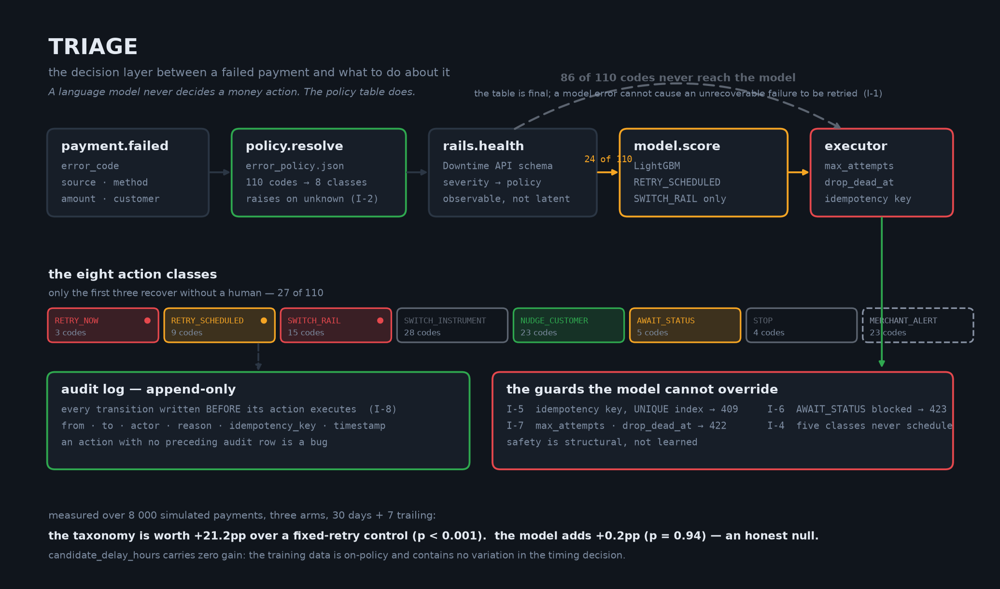

# TRIAGE

**Razorpay publishes 110 distinct payment failure reasons and explains what each one
means. It does not say what to do about them.**

TRIAGE is the missing decision layer. It reads a failure reason, checks whether the
rail is currently degraded, and returns a bounded, auditable action — retry now, retry
at a predicted time, switch rail, switch instrument, nudge the customer, wait for
status, stop, or alert the merchant.

The finding that justifies the whole build: **only 27 of the 110 codes are recoverable
without human intervention.** A naive "retry three times" loop is therefore wrong on
roughly three quarters of failures — and worse than wrong on five of them, where
retrying risks charging the customer twice.

Built for the Razorpay Buildathon, Track 03 — AI Revenue Recovery.

---

## The headline

Two contributions, measured separately over 8 000 simulated payments across three arms,
30 days plus a 7-day trailing window, at a fixed seed.

| gap | what it isolates | `normal` | `bank_outage` |
|---|---|---|---|
| **baseline − control** | the value of the **taxonomy** | **+21.2pp**, p < 0.001 | **+19.9pp**, p < 0.001 |
| **treatment − baseline** | the value of the **model** | **+0.2pp, p = 0.94** | **−0.2pp, p = 0.95** |

**The taxonomy is worth about twenty-one points. The model added nothing measurable.**

That is reported as it came out. On the model-eligible surface alone — the 24 of 110
codes where the model is even consulted — treatment is **−4.5pp** against baseline
(p = 0.52). Nothing was retuned to improve it.

### Why the model added nothing, precisely

The model is not the problem. On a held-out **temporal** test split it reaches PR-AUC
0.965 against a 0.247 base rate, and its top features are exactly the ones the research
predicted:

| feature | share of gain |
|---|---|
| `hours_since_first_failure` | 37.4% |
| `days_to_salary_date` | 21.1% |
| `day_of_month` | 13.4% |
| **`candidate_delay_hours`** | **0.000%** |

It found the Indian salary cycle from the calendar alone, without being told it exists.

And then it could not use it. **`candidate_delay_hours` carries zero gain**, because the
training data comes from the baseline arm, which schedules `RETRY_SCHEDULED` at exactly
`min_wait_hours` every single time. The dataset contains **no variation in the timing
decision the model was built to make**. It can rank *which cases* will recover; it
cannot rank *when* to retry, because nothing in its experience ever varied that.

This is off-policy evaluation without exploration. No amount of training fixes it. The
fix is an explorer arm that randomises delay within policy bounds — a change to the
simulator, not to the model — and it is the highest-value work left.

An honest null with a diagnosis is a stronger result than a number engineered to be
positive.

---

## Architecture



The line that matters is the dashed one: **86 of the 110 codes never reach the model at
all.** The policy table decides the action class; the model only ranks candidate
executions *within* a class the table has already permitted, and only for
`RETRY_SCHEDULED` and `SWITCH_RAIL`. A model error therefore cannot cause an
unrecoverable failure to be retried. Safety is structural, not learned.

```
payment.failed → policy.resolve → rails.health → [model.score] → executor → audit
                 110 → 8 classes   Downtime API    24 of 110      bounds     append-only
```

| Layer | What it does |
|---|---|
| `src/policy/` | Loads and validates `error_policy.json`. An unknown code raises; there is no default branch. |
| `src/simulator/` | Latent world state — true balance, salary day, card validity, outage timeline — behind a single resolution method. |
| `src/executor/` | Nine-state machine with legal edges declared as data. Bounds, idempotency, the AWAIT_STATUS block. |
| `src/features/` | 31 point-in-time features. `as_of` is required with no default. |
| `src/model/` | One row per attempt, temporal split, LightGBM, a scorer that refuses rather than guesses. |
| `src/arms/` | control (fixed +24h ×3), baseline (policy table), treatment (policy + model). |
| `eval/` | Tick loop, scoring, report generation. |
| `dashboard/` | Next.js. Four screens. |

---

## Results in full

Both scenarios, 8 000 payments, seed 42, three-way split by a stable hash of the case id.

| arm | payments | recovered | rate | 95% CI | attempts | nudges |
|---|---|---|---|---|---|---|
| `control` | 445 | 60 | 13.5% | 10.6 – 17.0% | 1063 | 0 |
| `baseline` | 447 | 155 | **34.7%** | 30.4 – 39.2% | **144** | 150 |
| `treatment` | 461 | 161 | **34.9%** | 30.7 – 39.4% | 141 | 158 |

Baseline recovers roughly 2.6× as many payments as control **using a seventh of the
attempts**. Cost is reported alongside recovery precisely because an arm that recovers
more using twice the attempts has not necessarily won.

### Where the gap comes from

| action class | control | baseline | note |
|---|---|---|---|
| `AWAIT_STATUS` | 0% | 91% | Control has no status poll, so the executor's I-6 guard blocks it — correctly. Its cases expire rather than double-charging. |
| `NUDGE_CUSTOMER` | 6% | 25% | Control burns three doomed retries; baseline sends one message. |
| `SWITCH_INSTRUMENT` | 0% | 0% | Neither recovers. Baseline stops at once; control spends its whole budget finding out. |
| `MERCHANT_ALERT` | 0% | 0% | Same. |

### Where the system loses

**`SWITCH_RAIL`: baseline 14/17 against control's 13/13.** Published in section 6 of both
reports and not tuned away.

Every simulated outage lasts 45–360 minutes — all shorter than control's 24-hour wait —
so "wait a day" accidentally dominates the class the taxonomy exists to fix, while
baseline switches at once onto an alternate rail that can fail for unrelated reasons.

The real-world case for rail switching is that the *customer* will not wait a day.
**Abandonment is not modelled here**, so the lever's main benefit is invisible to this
evaluation. Fixing that means modelling abandonment, not retuning the arm.

Full per-code tables, including every negative row, are in
[`eval/report-normal.md`](eval/report-normal.md) and
[`eval/report-bank-outage.md`](eval/report-bank-outage.md). Both are generated; neither
is hand-edited.

---

## Limitations

Named first, because a reviewer will find them anyway.

**From the research boundaries:**

- **Data is synthetic.** No public NPCI decline dataset exists. Simulator parameters are
  grounded in Razorpay's published figures where those exist and marked as our
  assumptions where they do not — see the CONFIG dict at the top of each simulator
  module. The arm comparison is robust to the simulator's absolute level because all
  arms face the identical generated population, but the absolute recovery rates are not
  forecasts.
- **Adaptive Acceptance cannot be replicated.** It reformats the authorization message,
  which requires issuer access. TRIAGE models the *decision*, not the reformatting.
- **Network Tokens are out of scope.** Requires network certification.
- **Card Account Updater is simulated.** Requires network membership.
- **The Downtime API requires account enablement.** Where unavailable, TRIAGE emits a
  simulated feed conforming to the published schema.

**Found while building:**

- **The simulator and the taxonomy make the same causal claim.** Both say a wrong PIN
  does not fix itself and an expired card cannot be charged. The evaluation therefore
  tests whether *acting* on that claim beats ignoring it — **not whether the claim is
  true**. This is the most important limitation in the project.
- **Per-code samples are small.** Roughly 150 cases per arm; per-code rows routinely
  carry n < 10, where a single case moves the rate by more than ten points. Read the
  per-code table as directional and the headline interval as the real precision.
- **The negative-EV STOP is structurally unreachable at Indian ticket sizes.**
  `EV = P(success) × amount − ₹2`. Against tickets of ₹99–₹25 000 the model would have to
  predict below ~0.04% for expected value to go negative. The mechanism is built, tested
  and wired to the audit trail, and it fired **zero** times. Reported as zero rather than
  made to fire by inflating the attempt cost.
- **The model's high AUC flatters.** The simulator's causal structure is largely exposed
  by the observable features, so a well-specified model *should* score highly here. Read
  it as "the features describe this world", not as a claim about production.
- **No auth.** research/05 specifies a Bearer key; it was out of scope. The deployed
  instance is read-only instead.

---

## Verification

Nothing in this README is asserted from memory. Four entry points regenerate it:

```bash
uv run pytest -v --durations=20              # 544 tests
bash scripts/verify_api.sh                   # 87 assertions, real uvicorn
uv run python scripts/verify_model.py        # 22 assertions, re-derived from model.txt
uv run python scripts/verify_determinism.py  # 22 assertions
```

**175 checks, zero failures.** Results and method are in
[`eval/PRODUCTION-CHECK.md`](eval/PRODUCTION-CHECK.md).

The one worth knowing about: `verify_model.py` re-derives PR-AUC from `model.txt` and
compares it to `metrics.json`. On its first run it disagreed by 0.0015 — which turned
out to be a real defect, not tolerance drift. `Scorer.score_batch` derived pandas
category *codes* from whichever values were in the batch, and LightGBM matches
categoricals by code, so scoring a five-candidate batch silently assigned `error_code` a
different code than training had. A plausible probability, quietly wrong. Level lists
are now pinned at training time.

### The invariants, and the tests that hold them

| | Invariant | Test |
|---|---|---|
| I-1 | The policy table decides the class; the model never does | `test_model_scope.py` |
| I-2 | An unknown code raises — never a default retry | `test_policy_coverage.py` |
| I-4 | Five classes never schedule a retry | `test_arms.py`, `test_nudge.py` |
| I-5 | Idempotency key on a UNIQUE index → 409 | `test_idempotency.py` |
| I-6 | AWAIT_STATUS cannot attempt without a poll → 423 | `test_await_status.py` |
| I-7 | Nothing fires past max_attempts or drop_dead_at → 422 | `test_bounds.py` |
| I-8 | Every transition audited **before** its action | `test_state_machine.py` |
| I-9 | Every rolling feature filters `event_time < as_of` | **`test_no_leakage.py`** |
| I-10 | Temporal splits, never random | `test_temporal_split.py` |
| I-12 | Latent state never reaches the decision path | `test_hidden_state.py` |
| I-13 | All arms consume identical payment streams | `test_arm_parity.py` |
| I-14–17 | Dedup, trailing window, negative rows, cost | `test_scoring.py` |

`test_no_leakage.py` is the one that matters. It has four checks, and only one of them
catches a real leak: build features at `as_of = T`, insert a batch of attempts,
recoveries and downtimes dated *after* T, rebuild at the same `as_of`, and assert every
value is byte-identical. A naive whole-table aggregate passes the signature, boundary
and isolation checks and fails only that one.

---

## Running it

```bash
# API
uv sync --extra dev --extra ml
uv run python -m src.simulator.generate --n 8000 --days 30 --seed 42
uv run uvicorn src.api.main:app --reload        # http://127.0.0.1:8000/docs

# Dashboard
cd dashboard && npm install
cp .env.local.example .env.local
npm run dev                                     # http://localhost:3000
```

Reproduce the evaluation from scratch:

```bash
uv run python -m eval.run_arms --seed 42 --scenario normal      --arms control,baseline,treatment
uv run python -m eval.run_arms --seed 42 --scenario bank_outage --arms control,baseline,treatment
```

Retrain the model (the 40 000-payment training population is not committed — 12 MB, and
it reproduces exactly):

```bash
uv run python -m eval.run_arms --seed 7 --scenario normal --n 40000 --arms baseline
uv run python -m src.model.train
```

Two runs at the same seed produce identical report JSON *and* identical rendered
markdown. That has held since Stage 2.

### Deployment

`Dockerfile` and `railway.toml` deploy the API to Railway with
`TRIAGE_READ_ONLY=true`: evaluation runs are baked into the image, and the instance
refuses every write — enforced both by a route dependency and by opening SQLite through
`mode=ro`. A public endpoint that can rewrite the numbers the submission reports is not
a demo. `POST /v1/recovery/decide` stays available because it is stateless.

The backend is live on Railway and redeploys automatically on a push to `main`; the
dashboard goes to Vercel with `dashboard/` as its root directory, reading the API's
location from `NEXT_PUBLIC_API_URL`. `DEPLOYMENT.md` has the full path and
`scripts/verify_live.sh` checks the deployed instance end to end.

---

## The dashboard

Four screens.

- **Live** — a Razorpay checkout replica on the left, the Inspector on the right. Pick
  any of the 110 codes from the scenario menu, or inject a downtime event, and watch the
  decision chain resolve against the real API. The `model.score` row renders **hollow**
  with *not invoked* on the 86 ineligible codes; its absence is the proof of I-1.
- **Taxonomy** — all 110 codes as a grid, coloured by triage category. The 27-of-110
  finding as an image.
- **Results** — both gaps separately, the model-eligible-only section, the losing
  segments, per-code rows including negatives.
- **Cases** — filterable case history; a row opens its audit trail.

---

## Attribution

**The 110 error reasons, their explanations and their next-steps text are Razorpay's
published documentation.** They are reproduced here as factual reference in a simulated
environment.

**This project's contribution is the layer on top:** the classification of all 110 codes
into eight recoverable action classes, the finding that only 27 are silently recoverable,
the decision policy, the bounded executor with its money-safety guards, the simulator,
and the three-arm evaluation.

The checkout pane deliberately matches Razorpay's layout, spacing and colour rhythm — the
"I studied your product" signal. It does **not** ship Razorpay's wordmark, and it uses
neutral text chips rather than trademarked card-network marks. The footer reads
*Simulated environment · TRIAGE*.

`error_policy.json` is ground truth for this repo and has never been edited to make a
result come out better.
